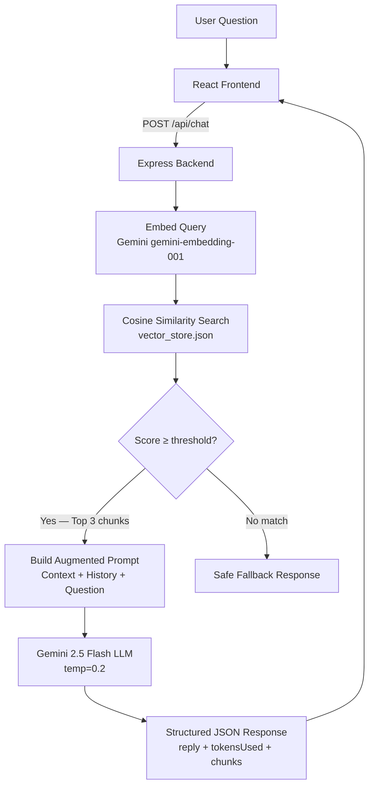

# 🤖 GenAI Assistant with RAG

A **production-grade Retrieval-Augmented Generation (RAG) chat assistant** built with Node.js, Google Gemini API, and React. Answers are grounded in a private knowledge base — no hallucinations.

---

## 📐 Architecture



---

## 🔄 RAG Workflow

1. **Ingest** (`npm run ingest`): Loads `docs.json` → chunks each doc (~1500 chars, 200-char overlap) → sends each chunk to **Gemini `gemini-embedding-001`** → saves `[{content, embedding, title, ...}]` to `vector_store.json`
2. **Query**: User message is embedded with the same model → compared against all stored vectors using **cosine similarity**
3. **Retrieve**: Top-3 chunks above a similarity threshold (default `0.65`) are selected
4. **Augment**: Retrieved chunks + last 5 conversation pairs are injected into the LLM prompt
5. **Generate**: Gemini 2.5 Flash responds based **only** on the provided context
6. **Fallback**: If no chunk scores above the threshold, a safe "I don't know" response is returned

---

## 🧠 Embedding Strategy

| Property | Value |
|---|---|
| Model | `gemini-embedding-001` (Gemini) |
| Dimensions | 768 |
| Chunk size | ~1500 characters (~300 words) |
| Chunk overlap | ~200 characters (~50 words) |
| Similarity metric | Cosine similarity |
| Threshold | 0.65 (configurable via `SIMILARITY_THRESHOLD` env var) |
| Top-K | 3 chunks per query |

Overlap ensures no context is lost at chunk boundaries. Cosine similarity is used (not dot product) so scores are normalized regardless of embedding magnitude.

---

## 🔍 Similarity Search

```js
// utils/vector_math.js
cosineSimilarity(queryVector, chunkVector)
// → filter score >= threshold
// → sort descending
// → take top 3
```

The `compute-cosine-similarity` npm package computes the exact cosine angle between two vectors, returning a score of 0–1. Only chunks above the threshold are passed to the prompt.

---

## 💬 Prompt Design

```
You are a helpful support assistant. Answer using ONLY the context below.
If you don't know, honestly say so.

CONTEXT FROM KNOWLEDGE BASE:
[1] (Source: "Password Reset", Relevance: 87.4%)
   Users can reset their password from Settings > Security...
[2] ...

CONVERSATION HISTORY:
User: ...
Assistant: ...

USER QUESTION:
How do I reset my password?

ANSWER:
```

**Rationale:**
- **Strict grounding instruction** prevents hallucination
- **Source + relevance score** gives the LLM transparency about chunk quality
- **Temperature 0.2** keeps responses factual and deterministic
- **History injection** enables multi-turn conversations without losing context

---

## 📁 Project Structure

```
rag-assistant/
├── backend/
│   ├── data/
│   │   ├── docs.json           # Raw knowledge base (10 documents)
│   │   └── vector_store.json   # Generated embeddings (run: npm run ingest)
│   ├── scripts/
│   │   └── ingest.js           # Chunking + embedding generation script
│   ├── utils/
│   │   ├── vector_math.js      # Cosine similarity + retrieveTopK
│   │   ├── rag.js              # Full RAG pipeline (embed → retrieve → prompt → LLM)
│   │   └── sessionStore.js     # In-memory session/history management
│   ├── server.js               # Express API server
│   ├── .env                    # Your API key (never commit!)
│   └── package.json
├── frontend/
│   ├── src/
│   │   ├── components/
│   │   │   ├── ChatWindow.jsx  # Message list + empty state
│   │   │   ├── ChatInput.jsx   # Auto-resize textarea + send button
│   │   │   └── MessageBubble.jsx # Markdown bubbles + metadata chips
│   │   ├── App.jsx             # Session management + API calls
│   │   └── index.css           # Premium dark-mode design system
│   └── package.json
└── README.md
```

---

## ⚙️ Setup Instructions

### Prerequisites
- Node.js v18+
- A free **Gemini API key** → [aistudio.google.com](https://aistudio.google.com)

### 1. Install backend dependencies
```bash
cd backend
npm install
```

### 2. Create your `.env` file
```bash
cp .env.example .env
# Edit .env and paste your Gemini API key
```

### 3. Generate embeddings (one-time)
```bash
npm run ingest
# → Creates backend/data/vector_store.json
```

### 4. Start the backend
```bash
npm start
# Server running at http://localhost:3001
```

### 5. Install and start the frontend (new terminal)
```bash
cd ../frontend
npm install
npm run dev
# App running at http://localhost:5173
```

---

## 🔌 API Reference

### `POST /api/chat`
```json
// Request
{ "sessionId": "abc123", "message": "How do I reset my password?" }

// Response
{
  "reply": "To reset your password, navigate to...",
  "tokensUsed": 342,
  "retrievedChunks": 3,
  "scores": [
    { "title": "Password Reset", "score": 0.874 },
    { "title": "Troubleshooting Login Issues", "score": 0.712 }
  ],
  "fallback": false,
  "latencyMs": 1240
}
```

### `POST /api/session/new`
```json
// Response
{ "sessionId": "550e8400-e29b-41d4-a716-446655440000" }
```

### `DELETE /api/session/:id`  
Clears conversation history for the given session.

### `GET /health`
```json
{ "status": "ok", "chunks": 14, "activeSessions": 2 }
```

---

## 🛡️ Error Handling

| Scenario | HTTP Code | Behavior |
|---|---|---|
| No relevant chunks found | 200 | Safe fallback response |
| Invalid/missing sessionId | 400 | Structured JSON error |
| Invalid Gemini API key | 401 | Clear error message |
| Rate limit exceeded | 429 | Retry suggestion |
| LLM/embedding timeout | 504 | Timeout error |
| Server crash | 500 | Generic error (no leaking) |

---

## 🔒 Security Notes
- API key stored in `.env`, never in source code
- `.env` is in `.gitignore`
- Input validated and length-capped (2000 chars max)
- No user data persisted to disk
